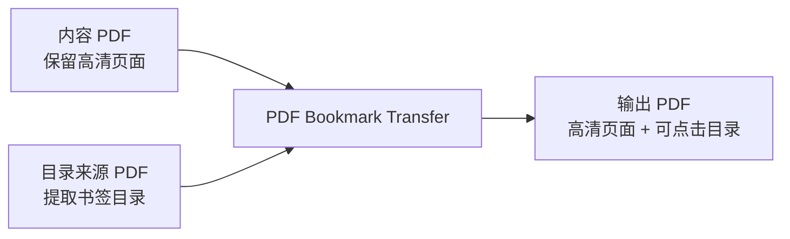

<div align="center">

# PDF Bookmark Transfer

<p><strong>将一份 PDF 的目录书签迁移到另一份页面更清晰的 PDF 中，生成“高清页面 + 可点击侧边目录”的最终文件。</strong></p>

<p>
  <a href="#downloads--releases">下载</a> ·
  <a href="#installation">安装</a> ·
  <a href="#usage">使用方式</a> ·
  <a href="#build--packaging">打包发布</a>
</p>

[简体中文](./README.md) | [English](./README_EN.md)

<p>
  
  
  
  
  
  
</p>

</div>

<div align="center">
  
</div>

## Overview

当 Word 或其他工具导出 PDF 时，常见会得到两种文件：

| 输入文件 | 特点 | 在本项目中的作用 |
| --- | --- | --- |
| `内容 PDF` | 页面内容清晰、图片分辨率高，但没有 PDF 侧边目录 | 作为最终输出的页面来源 |
| `目录来源 PDF` | 带有完整 PDF 目录书签，但页面内容不够清晰 | 作为目录结构的来源 |

`PDF Bookmark Transfer` 的目标很直接：

- 保留 `内容 PDF` 的页面内容
- 复制 `目录来源 PDF` 的书签树
- 输出一份新的融合版 PDF

这意味着你不需要重新渲染页面，也不需要手工重建目录。

## Downloads & Releases

| 渠道 | 推荐产物 | 说明 |
| --- | --- | --- |
| 源码运行 | 当前仓库 | 适合开发者，包含 CLI 和 `PySide6 / Qt` 图形界面 |
| macOS 桌面应用 | `PDF Bookmark Transfer-macOS.zip` | 最适合发布到 GitHub Releases，方便终端用户直接下载和解压 |
| macOS 本地调试 | `PDF Bookmark Transfer.app` | 适合本地测试或验证打包结果 |
| Windows 桌面应用 | 计划补充 | 核心逻辑已兼容，后续可继续补 `.exe` 打包流程 |

如果你准备把这个仓库公开发布，建议把 `PDF Bookmark Transfer-macOS.zip` 作为首个桌面版下载入口上传到 Releases。

## Highlights

- 保留原始页面内容，不重新压缩或重绘页面
- 复制 PDF 目录书签，并保留层级结构
- 尽量保留展开状态、颜色、粗体、斜体等书签样式
- 当两份 PDF 页面尺寸略有差异时，按比例修正跳转坐标
- 输出文件默认直接打开侧边目录栏
- 同时提供命令行工具和桌面图形界面
- GUI 基于 `PySide6 / Qt`，更适合 macOS 与 Windows 的原生交互
- 输出文件名会做跨平台校验，兼顾 Windows 文件名限制

## Interface Preview

> 下图是界面结构示意图，不是逐像素一致的真实截图。实际窗口外观会随 `PySide6 / Qt` 在 macOS 或 Windows 上的原生风格而变化。

<div align="center">
  
</div>

## Workflow



## Installation

### Runtime Requirements

- Python 3.11+
- `pypdf`
- `PySide6-Essentials`
- `shiboken6`

安装依赖：

```bash
python3 -m pip install -r requirements.txt
```

如果你只使用命令行版本，核心上只需要 `pypdf`。

## Usage

### Desktop GUI

启动图形界面：

```bash
python3 pdf_bookmark_transfer_app.py
```

使用流程：

1. 选择 `内容 PDF`
2. 选择 `目录来源 PDF`
3. 按需修改输出文件名
4. 按需修改保存位置
5. 点击“开始转换”

默认行为：

- 保存位置默认与 `内容 PDF` 相同
- 输出文件名默认是原文件名追加 `_with_bookmarks.pdf`
- 如果目标文件已存在，应用会先弹窗确认是否覆盖

### Command Line

命令行示例：

```bash
python3 merge_pdf_bookmarks.py \
  --content "content.pdf" \
  --bookmarks "bookmark-source.pdf" \
  --output "content_with_bookmarks.pdf"
```

支持参数：

- `--content`：要保留页面内容的 PDF
- `--bookmarks`：要复制目录书签的 PDF
- `--output`：输出文件路径
- `--force`：当输出文件已存在时直接覆盖

如果不传 `--output`，程序会默认输出到 `内容 PDF` 同目录下，并自动生成文件名。

## Build & Packaging

仓库已经提供了 `PyInstaller` 打包配置，可直接生成适合 macOS 分发的 `.app` 和 `.zip`。

```bash
python3 -m venv .venv-build
./.venv-build/bin/python -m pip install -r requirements-build.txt
./build_macos_app.sh
```

构建产物：

- `dist/PDF Bookmark Transfer.app`
- `dist/PDF Bookmark Transfer-macOS.zip`

发布建议：

- 将 `PDF Bookmark Transfer-macOS.zip` 作为 GitHub Releases 的主下载文件
- 保留源码安装方式，方便 Windows 用户或自动化场景使用
- 后续若做正式公开分发，可继续补 Developer ID 签名、notarization 和校验文件

## Technical Approach

这个项目不是把两份 PDF 再“拼图式重导出”一遍，而是走一条更稳妥的路径：

1. 读取 `内容 PDF`，完整保留其页面
2. 读取 `目录来源 PDF` 的 outline / bookmarks 结构
3. 递归复制书签层级、样式和跳转目标
4. 写出新的 PDF，并默认设置为打开时显示目录栏

这种做法的直接收益是：

- 高清图片不会因为二次导出而被压缩
- 转换速度更快
- 输出结果更接近原始高质量 PDF
- 实现逻辑简单、稳定，适合重复使用和自动化

## Compatibility

- `macOS`：提供基于 `PySide6 / Qt` 的桌面 GUI，并附带 `PyInstaller` 打包流程
- `Windows`：核心逻辑与 GUI 设计已兼容，输出文件名也会避开 Windows 保留名和非法字符
- `CLI`：核心 PDF 处理逻辑不依赖平台特有 API，适合脚本化调用

## Constraints

这个方案成立的前提是两份 PDF 的分页语义保持一致：

- 页数一致
- 页面顺序一致
- 同一章节落在相同页码上

以下情况不适合直接复制目录：

- 两份 PDF 页数不同
- 其中一份额外插入了空白页
- 两份 PDF 的分页位置已经变化
- 同一章节在两份文件中不再位于同一页

如果遇到这些情况，就需要额外的页码映射逻辑，而不是直接迁移书签。

## Troubleshooting

- 如果 `目录来源 PDF` 本身没有书签目录，程序会直接报错
- 如果某个书签指向超出 `内容 PDF` 页数范围的页面，程序会直接报错
- 输出文件不能与任一输入文件同名
- 输出文件名只能填写文件名本身，不能包含路径分隔符
- 如果系统未安装 Qt 依赖，GUI 会提示先安装 `PySide6-Essentials` 与 `shiboken6`

## Project Docs

- [CONTRIBUTING.md](./CONTRIBUTING.md)：协作与提交流程
- [CHANGELOG.md](./CHANGELOG.md)：版本变化记录
- [RELEASING.md](./RELEASING.md)：发布流程说明
- [LICENSE](./LICENSE)：开源许可证
- `requirements.txt`：运行依赖
- `requirements-build.txt`：打包依赖

## Repository Layout

```text
.
├── docs/
│   └── assets/
│       ├── gui-preview.svg
│       └── project-hero.svg
├── LICENSE
├── CHANGELOG.md
├── CONTRIBUTING.md
├── build_macos_app.sh
├── merge_pdf_bookmarks.py
├── pdf_bookmark_transfer_app.py
├── pdf_bookmark_transfer_app.spec
├── README.md
├── README_EN.md
├── RELEASING.md
├── requirements-build.txt
└── requirements.txt
```

关键文件：

- `LICENSE`：项目开源许可证
- `CHANGELOG.md`：版本变更记录
- `CONTRIBUTING.md`：协作指南
- `RELEASING.md`：发布步骤说明
- `merge_pdf_bookmarks.py`：命令行入口与核心 PDF 目录迁移逻辑
- `pdf_bookmark_transfer_app.py`：基于 `PySide6 / Qt` 的桌面图形界面
- `pdf_bookmark_transfer_app.spec`：PyInstaller 打包配置
- `build_macos_app.sh`：构建 macOS `.app` 与 `.zip` 的脚本
- `requirements.txt`：运行依赖定义
- `requirements-build.txt`：打包依赖定义
- `docs/assets/project-hero.svg`：README 首页头图

## Verification

当前项目已完成本地验证，包括：

- 使用样例 PDF 成功生成融合版输出文件
- 输出页数保持不变
- 侧边目录能够正常显示和点击跳转
- 中文目录标题可正常显示
- macOS `.app` 可成功打包，并通过 `codesign --verify --deep --strict` 结构校验

## Roadmap

- 补充 Windows `PyInstaller` 打包，生成更适合终端用户使用的 `.exe`
- 为页码发生偏移的 PDF 增加可选页码映射能力
- 在界面完全稳定后补充真实 GUI 截图，替换当前示意图或与之并列展示

## Contributing

欢迎通过 Issue 或 PR 一起完善这个项目，尤其适合补充这些方向：

- Windows 打包流程
- 更多真实 PDF 样例与回归测试
- 更复杂的目录映射场景
- 发布自动化与 CI 配置

## License

本项目采用 [MIT License](./LICENSE)。
