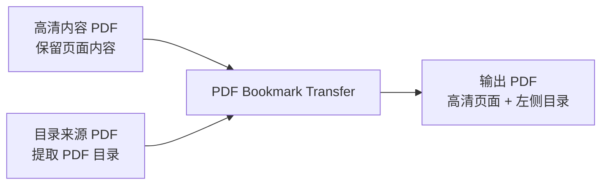

<div align="center">

# PDF Bookmark Transfer

将一份 PDF 的侧边目录书签，转移到另一份保留高清页面内容的 PDF 上。

[简体中文](./README.md) | [English](./README_EN.md)

<p>
  
  
  
  
</p>

</div>

> 一份 PDF 图片清晰但没有左侧目录，另一份 PDF 有目录但图片不够清晰。这个项目就是用来把两者合成成一份“高清页面 + PDF 目录”成品。

## UI Mockup

下面这张图是界面结构示意图，不是实机截图。

说明：

- 这张图用于表达应用的布局和交互流程
- `PySide6 / Qt` 在 macOS / Windows / Linux 上会跟随不同平台风格
- 实际按钮样式、字体和间距会与示意图有所不同

<div align="center">
  
</div>

## Why This Project

Word 导出 PDF 时常见会遇到这两类文件：

- `高清内容 PDF`
  说明：页面内容清晰，但没有 PDF 左侧目录
- `目录来源 PDF`
  说明：带有完整 PDF 左侧目录，但页面中的图片不够清晰

这个项目的目标是：

- 保留 `高清内容 PDF` 的页面内容
- 复制 `目录来源 PDF` 的目录书签
- 输出一份新的融合版 PDF

## Features

- 保留高清内容 PDF 的页面内容，不重新渲染页面
- 复制目录来源 PDF 的侧边目录结构
- 保留目录层级、展开状态、字体样式和颜色
- 尽量保留目录点击后的页内跳转位置
- 支持图形界面，一键点选文件完成转换
- 支持命令行，便于脚本化或批处理
- 图形界面基于 `PySide6 / Qt`
- 处理中文目录标题编码，避免乱码

## Supported Platforms

- macOS
  说明：Qt 使用 macOS 原生窗口与交互模型
- Windows
  说明：Qt 使用 Windows 原生窗口风格，并具备更稳定的高 DPI 支持

平台说明：

- `PySide6 / Qt` 会按平台使用原生或接近原生的控件体验
- README 中的界面图是示意图，不是逐像素一致的真实截图
- CLI 与核心 PDF 处理逻辑不依赖平台特有 API，主要差异集中在桌面界面体验

## Workflow



## Quick Start

### 1. 安装依赖

需要：

- Python 3
- `pypdf`
- `PySide6-Essentials`
- `shiboken6`

说明：

- `pypdf` 用于读写 PDF
- `PySide6-Essentials` 与 `shiboken6` 用于桌面图形界面

安装依赖：

```bash
python3 -m pip install pypdf PySide6-Essentials shiboken6
```

### 2. 运行图形界面

如果你希望通过鼠标点选文件直接转换，运行：

```bash
python3 pdf_bookmark_transfer_app.py
```

操作步骤：

1. 选择 `高清内容 PDF`
2. 选择 `目录来源 PDF`
3. 修改输出文件名
4. 选择保存位置
5. 点击“开始转换”

默认行为：

- 保存位置默认与 `高清内容 PDF` 相同
- 输出文件名默认是原文件名追加 `_with_bookmarks.pdf`
- 如果目标文件已存在，会先弹窗确认是否覆盖

### 3. 运行命令行版本

如果你更习惯命令行：

```bash
python3 merge_pdf_bookmarks.py \
  --content "高清内容版.pdf" \
  --bookmarks "目录来源版.pdf" \
  --output "高清内容版_带目录.pdf"
```

支持的参数：

- `--content`
  说明：要保留页面内容的 PDF
- `--bookmarks`
  说明：要复制目录的 PDF
- `--output`
  说明：输出文件路径
- `--force`
  说明：输出文件已存在时直接覆盖

如果不传 `--output`，默认会输出到 `高清内容 PDF` 同目录下，并自动生成文件名。

### 4. 打包 macOS `.app`

如果你希望生成适合 mac 分发的 GUI 应用：

```bash
python3 -m venv .venv-build
./.venv-build/bin/python -m pip install --no-cache-dir -i https://pypi.tuna.tsinghua.edu.cn/simple PyInstaller pypdf PySide6-Essentials shiboken6
./build_macos_app.sh
```

构建结果：

- `dist/PDF Bookmark Transfer.app`
  说明：可直接在 macOS 上打开的 GUI 应用
- `dist/PDF Bookmark Transfer-macOS.zip`
  说明：更适合发给别人下载和解压的分发包

## How It Works

这个项目不会重新拼接页面图像，也不会重新导出 PDF 页面。

它采用的是更稳的一条路线：

1. 完整保留 `高清内容 PDF` 的页面内容
2. 读取 `目录来源 PDF` 的 PDF 书签结构
3. 递归复制目录层级、样式和跳转目标
4. 生成新的 PDF 输出文件

这条路线的优点是：

- 高清图片不会被二次压缩
- 转换速度快
- 输出更接近原始导出文件
- 实现逻辑稳定，适合重复使用

## What Gets Preserved

当前会尽量保留以下目录信息：

- 目录层级结构
- 展开 / 折叠状态
- 目录项颜色
- 粗体 / 斜体样式
- 点击目录后的页内跳转位置
- PDF 默认打开时显示左侧目录栏
- 中文目录标题

## Limitations

这个方案成立的关键前提是：

- 两份 PDF 页数一致
- 两份 PDF 分页顺序一致
- 同一章节在两份 PDF 中落在同一页

如果出现下面这些情况，就不能直接复制目录：

- 两份 PDF 页数不同
- 其中一份多了空白页
- 两份 PDF 的分页位置不一致
- 同一章节在两份 PDF 中已经不在同一页

这种情况下，需要额外做页码映射，不能直接迁移书签。

## Repository Structure

```text
.
├── docs/
│   └── assets/
│       └── gui-preview.svg
├── build_macos_app.sh
├── merge_pdf_bookmarks.py
├── pdf_bookmark_transfer_app.py
├── pdf_bookmark_transfer_app.spec
├── README.md
└── README_EN.md
```

主要文件说明：

- `merge_pdf_bookmarks.py`
  命令行入口和核心合并逻辑
- `pdf_bookmark_transfer_app.py`
  基于 `PySide6 / Qt` 的图形界面入口
- `pdf_bookmark_transfer_app.spec`
  PyInstaller 的 macOS 打包配置
- `build_macos_app.sh`
  一键构建 macOS `.app` 与 `.zip` 的脚本
- `docs/assets/gui-preview.svg`
  README 使用的界面示意图

## Local Verification

当前项目已经使用本地样本 PDF 完成验证，验证结果包括：

- 成功生成新的融合版 PDF
- 输出文件页数保持不变
- 侧边目录可以正常读取
- 中文目录标题可以正常显示

## Notes

- 输出文件不能与任一输入文件同名
- 输出文件名只能填写文件名本身，不要包含路径分隔符
- 若本机未安装 Qt 运行依赖，GUI 会提示先安装 `PySide6-Essentials` 与 `shiboken6`
- 如果目录来源 PDF 本身没有书签目录，程序会报错
- 如果目录页码超出高清内容 PDF 的页数范围，程序会报错
- 如果两份 PDF 页面尺寸略有差异，会按比例修正页内跳转位置

## License

当前仓库尚未添加许可证文件；如果你准备公开发布，建议补充 `LICENSE`。
