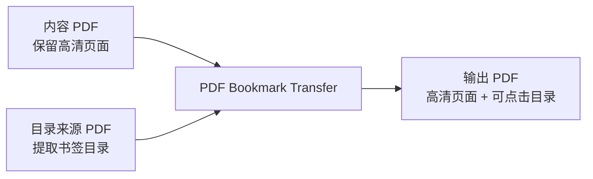

<div align="center">

# PDF Bookmark Transfer

<p><strong>将一份 PDF 的目录书签迁移到另一份页面更清晰的 PDF 中，生成“高清页面 + 可点击侧边目录”的最终文件。</strong></p>

<p>
  <a href="#official-downloads">官方下载</a> ·
  <a href="#installation">安装</a> ·
  <a href="#usage">使用方式</a> ·
  <a href="#release--automation">发布与自动构建</a>
</p>

[简体中文](./README.md) | [English](./README_EN.md)

<p>
  
  
  
  
  
  
  
  
</p>

</div>

<div align="center">
  
</div>

## Overview

`PDF Bookmark Transfer` 面向这样一类常见场景：同一份文档往往会导出两种 PDF，一份页面内容清晰但没有侧边目录，另一份带有完整目录书签但图片和页面质量不够理想。

本项目将两者融合为一份成品 PDF：

| 输入文件 | 典型特征 | 在本项目中的角色 |
| --- | --- | --- |
| `内容 PDF` | 页面内容清晰、图片分辨率高，但没有 PDF 侧边目录 | 提供最终输出的页面内容 |
| `目录来源 PDF` | 带有完整 PDF 目录书签，但页面质量不够理想 | 提供目录树、跳转目标和书签样式 |

输出结果保留 `内容 PDF` 的页面，同时复制 `目录来源 PDF` 的目录结构，避免二次压缩页面或手工重建目录。

## Official Downloads

官方桌面包通过 GitHub Releases 分发，并由 GitHub Actions 自动构建。

| 平台 | 发布资产 | 下载入口 | 说明 |
| --- | --- | --- | --- |
| macOS | `PDF Bookmark Transfer-macOS.zip` | [下载 macOS 最新版](https://github.com/Zhairest/PDF_Bookmark_Transfer/releases/latest/download/PDF%20Bookmark%20Transfer-macOS.zip) | 解压后得到 `.app` 图形界面应用 |
| Windows | `PDF Bookmark Transfer-windows.zip` | [下载 Windows 最新版](https://github.com/Zhairest/PDF_Bookmark_Transfer/releases/latest/download/PDF%20Bookmark%20Transfer-windows.zip) | 解压后得到包含 `PDF Bookmark Transfer.exe` 的桌面应用目录 |
| 校验文件 | `SHA256SUMS.txt` | [下载校验文件](https://github.com/Zhairest/PDF_Bookmark_Transfer/releases/latest/download/SHA256SUMS.txt) | SHA-256 校验值 |
| 历史版本 | GitHub Releases | [Releases 页面](https://github.com/Zhairest/PDF_Bookmark_Transfer/releases) | 查看所有版本与发布说明 |

## Key Capabilities

- 保留原始页面内容，不重新渲染或压缩页面
- 复制 PDF 目录书签，并保留层级结构
- 尽量保留展开状态、颜色、粗体、斜体等书签样式
- 在页面尺寸略有差异时，按比例修正跳转坐标
- 输出文件默认设置为打开时显示 PDF 目录栏
- 提供 `PySide6 / Qt` 图形界面，适合桌面用户直接使用
- 提供命令行入口，便于自动化、脚本化和批处理
- 提供 macOS 与 Windows 桌面发布包
- 通过版本 tag 自动构建并发布 GitHub Releases

## Interface Preview

> 下图为界面结构示意图，不是逐像素一致的真实截图。实际窗口外观会随 `PySide6 / Qt` 在 macOS 或 Windows 上的原生风格而变化。

<div align="center">
  
</div>

## Workflow



## Installation

### Runtime Requirements

- Python 3.11+
- `pypdf`
- `PySide6-Essentials`
- `shiboken6`

从源码运行时可安装：

```bash
python3 -m pip install -r requirements.txt
```

仅使用命令行时，核心依赖为 `pypdf`。

## Usage

### Desktop GUI

启动桌面图形界面：

```bash
python3 pdf_bookmark_transfer_app.py
```

典型流程：

1. 选择 `内容 PDF`
2. 选择 `目录来源 PDF`
3. 按需修改输出文件名
4. 按需修改保存位置
5. 点击“开始转换”

默认行为：

- 保存位置默认与 `内容 PDF` 相同
- 输出文件名默认追加 `_with_bookmarks.pdf`
- 若目标文件已存在，转换前会先弹窗确认是否覆盖

### Command Line

命令行示例：

```bash
python3 merge_pdf_bookmarks.py \
  --content "content.pdf" \
  --bookmarks "bookmark-source.pdf" \
  --output "content_with_bookmarks.pdf"
```

支持参数：

- `--content`：要保留页面内容的 PDF
- `--bookmarks`：要复制目录书签的 PDF
- `--output`：输出文件路径
- `--force`：当输出文件已存在时直接覆盖

未传 `--output` 时，程序会默认在 `内容 PDF` 同目录下生成输出文件名。

## Release & Automation

官方桌面发布流程由 [`.github/workflows/release.yml`](./.github/workflows/release.yml) 驱动。

当推送 `v*` 格式的版本 tag 时，工作流会自动执行以下任务：

- 在 `macos-13` runner 上构建 `PDF Bookmark Transfer-macOS.zip`
- 在 `windows-latest` runner 上构建 `PDF Bookmark Transfer-windows.zip`
- 生成 `SHA256SUMS.txt`
- 将构建产物自动附加到对应的 GitHub Release

本地打包脚本：

- [build_macos_app.sh](./build_macos_app.sh)：构建 macOS `.app` 与 `.zip`
- [build_windows_app.ps1](./build_windows_app.ps1)：构建 Windows 发布目录与 `.zip`
- [pdf_bookmark_transfer_app.spec](./pdf_bookmark_transfer_app.spec)：跨平台 `PyInstaller` 配置

本地安装打包依赖：

```bash
python3 -m venv .venv-build
./.venv-build/bin/python -m pip install -r requirements-build.txt
```

## Technical Notes

### What Is Preserved

- 目录层级结构
- 展开 / 折叠状态
- 目录颜色
- 粗体 / 斜体样式
- 页内跳转目标
- PDF 默认打开时显示目录栏
- 中文目录标题

### Assumptions

直接迁移目录成立的前提是两份 PDF 的分页语义保持一致：

- 页数一致
- 页面顺序一致
- 同一章节位于相同页码

### Non-Goals

以下情况不属于直接书签迁移的适用范围：

- 两份 PDF 页数不同
- 其中一份插入了空白页
- 两份 PDF 的分页位置已经变化
- 同一章节在两份文件中不再位于同一页

此类情况需要额外的页码映射逻辑，而不是直接复制目录。

### Failure Conditions

- `目录来源 PDF` 本身没有书签目录
- 书签指向超出 `内容 PDF` 页数范围的页面
- 输出文件路径与任一输入文件相同
- 输出文件名包含跨平台不兼容字符

## Project Structure

```text
.
├── .github/
│   └── workflows/
│       └── release.yml
├── docs/
│   └── assets/
│       ├── gui-preview.svg
│       └── project-hero.svg
├── CHANGELOG.md
├── CONTRIBUTING.md
├── LICENSE
├── README.md
├── README_EN.md
├── RELEASING.md
├── build_macos_app.sh
├── build_windows_app.ps1
├── merge_pdf_bookmarks.py
├── pdf_bookmark_transfer_app.py
├── pdf_bookmark_transfer_app.spec
├── requirements-build.txt
└── requirements.txt
```

关键文件：

- [merge_pdf_bookmarks.py](./merge_pdf_bookmarks.py)：命令行入口与核心 PDF 目录迁移逻辑
- [pdf_bookmark_transfer_app.py](./pdf_bookmark_transfer_app.py)：基于 `PySide6 / Qt` 的桌面图形界面
- [pdf_bookmark_transfer_app.spec](./pdf_bookmark_transfer_app.spec)：跨平台 `PyInstaller` 打包配置
- [build_macos_app.sh](./build_macos_app.sh)：macOS 打包脚本
- [build_windows_app.ps1](./build_windows_app.ps1)：Windows 打包脚本
- [`.github/workflows/release.yml`](./.github/workflows/release.yml)：GitHub Releases 自动构建与发布流程
- [docs/assets/project-hero.svg](./docs/assets/project-hero.svg)：README 首页头图
- [docs/assets/gui-preview.svg](./docs/assets/gui-preview.svg)：README 界面示意图

## Development Docs

- [CHANGELOG.md](./CHANGELOG.md)：版本变化记录
- [CONTRIBUTING.md](./CONTRIBUTING.md)：协作与提交流程
- [RELEASING.md](./RELEASING.md)：版本发布流程
- [LICENSE](./LICENSE)：MIT 开源许可证
- [requirements.txt](./requirements.txt)：运行依赖
- [requirements-build.txt](./requirements-build.txt)：打包依赖

## Verification

当前仓库已完成的验证包括：

- 核心 PDF 目录迁移逻辑已通过本地样例验证
- macOS `.app` 与 `.zip` 已完成本地打包
- macOS `.app` 已通过 `codesign --verify --deep --strict` 结构校验
- GitHub Release 工作流已配置为同时构建 macOS 与 Windows 发布资产

## License

本项目采用 [MIT License](./LICENSE)。
