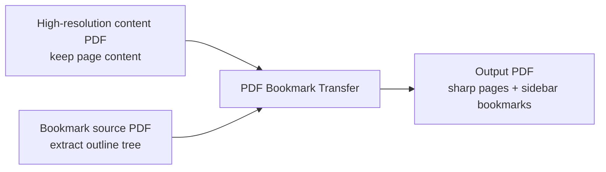

<div align="center">

# PDF Bookmark Transfer

Transfer PDF sidebar bookmarks from one PDF to another while preserving the high-resolution page content.

[简体中文](./README.md) | [English](./README_EN.md)

<p>
  
  
  
  
</p>

</div>

> One PDF export keeps the images sharp but loses the sidebar bookmarks. Another export keeps the bookmarks but downgrades image quality. This project combines them into a single output: high-resolution pages plus working PDF bookmarks.

## UI Mockup

The image below is a layout mockup, not a real screenshot.

Notes:

- it is meant to explain the structure and interaction flow
- `PySide6 / Qt` follows platform-native behavior across macOS, Windows, and Linux
- actual button appearance, spacing, and fonts will vary by platform

<div align="center">
  
</div>

## Why This Project

When exporting PDFs from Word, you may end up with two different files:

- `High-resolution content PDF`
  Description: keeps the page content sharp, but has no PDF sidebar bookmarks
- `Bookmark source PDF`
  Description: contains a valid bookmark tree, but the page content is not sharp enough

This project is built to:

- keep the pages from the `High-resolution content PDF`
- copy bookmarks from the `Bookmark source PDF`
- produce one merged PDF with both benefits

## Features

- Preserves the page content from the high-resolution PDF without re-rendering pages
- Copies the sidebar bookmark structure from the bookmark source PDF
- Preserves outline hierarchy, open state, font styles, and colors
- Keeps page-internal jump targets as accurately as possible
- Includes a desktop GUI for point-and-click conversion
- Includes a CLI for automation and scripting
- The desktop GUI is built with `PySide6 / Qt`
- Handles Chinese bookmark titles correctly to avoid garbled text

## Supported Platforms

- macOS
  Description: Qt uses the native macOS windowing and interaction model
- Windows
  Description: Qt uses native Windows styling and more stable high-DPI behavior

Platform notes:

- `PySide6 / Qt` follows native or near-native platform behavior
- the README graphic is a mockup, not a pixel-perfect screenshot
- the CLI and core PDF merge logic are platform-agnostic; most differences are in desktop UI behavior

## Workflow



## Quick Start

### 1. Requirements

- Python 3
- `pypdf`
- `PySide6-Essentials`
- `shiboken6`

Notes:

- `pypdf` is used to read and write PDF files
- `PySide6-Essentials` and `shiboken6` are used for the desktop GUI

Install dependencies:

```bash
python3 -m pip install pypdf PySide6-Essentials shiboken6
```

### 2. Run the GUI

If you want a point-and-click workflow:

```bash
python3 pdf_bookmark_transfer_app.py
```

Steps:

1. Select the `High-resolution content PDF`
2. Select the `Bookmark source PDF`
3. Edit the output file name if needed
4. Choose the output directory if needed
5. Click the `开始转换` button

Default behavior:

- The output directory defaults to the same folder as the high-resolution content PDF
- The output name defaults to the original file name plus `_with_bookmarks.pdf`
- If the output file already exists, the app asks for confirmation before overwriting it

### 3. Run the CLI

If you prefer the command line:

```bash
python3 merge_pdf_bookmarks.py \
  --content "high-res.pdf" \
  --bookmarks "bookmark-source.pdf" \
  --output "high-res_with_bookmarks.pdf"
```

Supported arguments:

- `--content`
  Description: the PDF whose page content should be preserved
- `--bookmarks`
  Description: the PDF whose bookmarks should be copied
- `--output`
  Description: output PDF path
- `--force`
  Description: overwrite the output file if it already exists

If `--output` is omitted, the tool creates a default output path next to the content PDF.

### 4. Build a macOS `.app`

If you want a distributable macOS GUI application:

```bash
python3 -m venv .venv-build
./.venv-build/bin/python -m pip install --no-cache-dir -i https://pypi.tuna.tsinghua.edu.cn/simple PyInstaller pypdf PySide6-Essentials shiboken6
./build_macos_app.sh
```

Build outputs:

- `dist/PDF Bookmark Transfer.app`
  Description: the macOS GUI application bundle
- `dist/PDF Bookmark Transfer-macOS.zip`
  Description: the zipped distribution artifact, better suited for sharing

## How It Works

This project does not try to rebuild pages or recompose page graphics.

Instead, it follows a more reliable path:

1. Keep all pages from the `High-resolution content PDF`
2. Read the outline tree from the `Bookmark source PDF`
3. Recursively copy bookmark hierarchy, styles, and destinations
4. Write a new merged PDF

Benefits of this approach:

- sharp images are not recompressed
- conversion is fast
- output stays close to the original export
- the implementation is stable and easy to reuse

## What Gets Preserved

The tool tries to preserve:

- bookmark hierarchy
- expanded / collapsed state
- bookmark colors
- bold / italic styles
- page-internal jump positions
- default PDF page mode for showing the outline pane
- Chinese bookmark titles

## Limitations

This approach assumes that:

- both PDFs have the same page count
- both PDFs use the same page order
- the same section appears on the same page in both PDFs

If any of the following happens, direct bookmark transfer is no longer safe:

- the PDFs have different page counts
- one PDF contains extra blank pages
- pagination differs between the two files
- the same section no longer lands on the same page

In such cases, you need an explicit page-mapping layer instead of direct outline transfer.

## Repository Structure

```text
.
├── docs/
│   └── assets/
│       └── gui-preview.svg
├── build_macos_app.sh
├── merge_pdf_bookmarks.py
├── pdf_bookmark_transfer_app.py
├── pdf_bookmark_transfer_app.spec
├── README.md
└── README_EN.md
```

Key files:

- `merge_pdf_bookmarks.py`
  CLI entry point and core merge logic
- `pdf_bookmark_transfer_app.py`
  `PySide6 / Qt` desktop GUI entry point
- `pdf_bookmark_transfer_app.spec`
  PyInstaller configuration for the macOS app bundle
- `build_macos_app.sh`
  one-command script for building the macOS `.app` and `.zip`
- `docs/assets/gui-preview.svg`
  preview asset used by the README

## Local Verification

The project has already been validated locally with sample PDFs. Verified results include:

- a merged PDF is generated successfully
- the output page count remains unchanged
- sidebar bookmarks are readable
- Chinese bookmark titles display correctly

## Notes

- the output file must not reuse either input file path
- the output name should only be a file name, not a path with separators
- if the Qt runtime is missing, the GUI will prompt you to install `PySide6-Essentials` and `shiboken6` first
- the tool fails if the bookmark source PDF has no outline tree
- the tool fails if a bookmark points beyond the page range of the content PDF
- if the page sizes differ slightly, jump coordinates are scaled proportionally

## License

No license file is included yet. If you plan to publish this repository publicly, adding a `LICENSE` file is recommended.
