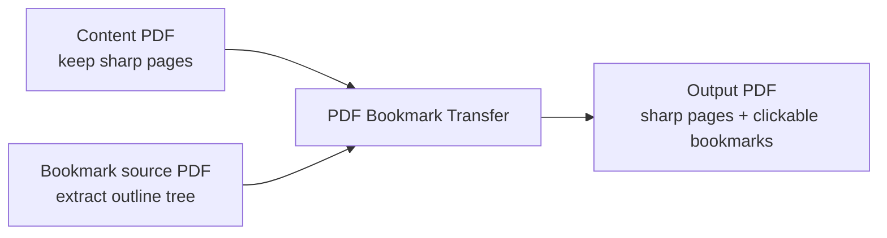

<div align="center">

# PDF Bookmark Transfer

<p><strong>Transfer bookmark outlines from one PDF onto another PDF with sharper page content, without recompressing the pages.</strong></p>

<p>
  <a href="#downloads--releases">Downloads</a> ·
  <a href="#installation">Installation</a> ·
  <a href="#usage">Usage</a> ·
  <a href="#build--packaging">Packaging</a>
</p>

[简体中文](./README.md) | [English](./README_EN.md)

<p>
  
  
  
  
  
  
</p>

</div>

<div align="center">
  
</div>

## Overview

PDF exports from Word or similar tools often leave you with two versions of the same document:

| Input file | Typical characteristic | Role in this project |
| --- | --- | --- |
| `Content PDF` | Sharp page content and high-resolution images, but no sidebar bookmarks | Provides the final page content |
| `Bookmark source PDF` | Contains a valid bookmark tree, but page quality is not good enough | Provides the outline structure |

`PDF Bookmark Transfer` combines the two:

- keep the pages from the `Content PDF`
- copy the bookmark tree from the `Bookmark source PDF`
- produce one merged PDF with both benefits

This avoids page re-rendering and eliminates the need to rebuild bookmarks manually.

## Downloads & Releases

| Channel | Recommended artifact | Notes |
| --- | --- | --- |
| Source checkout | This repository | Best for developers; includes both the CLI and the `PySide6 / Qt` desktop app |
| macOS desktop app | `PDF Bookmark Transfer-macOS.zip` | Recommended asset for GitHub Releases and direct end-user downloads |
| macOS local bundle | `PDF Bookmark Transfer.app` | Useful for local testing and packaging verification |
| Windows desktop app | Planned next | The core logic is already compatible; a packaged `.exe` can be added next |

If you publish this repository on GitHub, `PDF Bookmark Transfer-macOS.zip` is the best first desktop asset to upload under Releases.

## Highlights

- Preserves the original page content instead of redrawing or recompressing pages
- Copies the PDF bookmark tree while keeping its hierarchy
- Preserves bookmark open state, color, bold, and italic styling where available
- Scales jump coordinates proportionally when page sizes differ slightly
- Sets the output PDF to open with the outline pane visible
- Includes both a desktop GUI and a CLI workflow
- Uses `PySide6 / Qt` for a more reliable macOS and Windows desktop experience
- Validates output file names with Windows compatibility in mind

## Interface Preview

> The image below is an interface illustration, not a literal screenshot. Actual widget appearance follows the native `PySide6 / Qt` style of the host platform.

<div align="center">
  
</div>

## Workflow



## Installation

### Runtime Requirements

- Python 3.11+
- `pypdf`
- `PySide6-Essentials`
- `shiboken6`

Install dependencies:

```bash
python3 -m pip install -r requirements.txt
```

If you only need the CLI, `pypdf` is the only core runtime dependency.

## Usage

### Desktop GUI

Launch the GUI:

```bash
python3 pdf_bookmark_transfer_app.py
```

Typical flow:

1. Select the `Content PDF`
2. Select the `Bookmark source PDF`
3. Edit the output file name if needed
4. Change the output directory if needed
5. Click `开始转换`

Default behavior:

- the output directory defaults to the same folder as the `Content PDF`
- the output file name defaults to the source name plus `_with_bookmarks.pdf`
- if the output file already exists, the app asks for confirmation before overwriting it

### Command Line

CLI example:

```bash
python3 merge_pdf_bookmarks.py \
  --content "content.pdf" \
  --bookmarks "bookmark-source.pdf" \
  --output "content_with_bookmarks.pdf"
```

Supported arguments:

- `--content`: the PDF whose page content should be preserved
- `--bookmarks`: the PDF whose bookmark tree should be copied
- `--output`: output file path
- `--force`: overwrite the output file if it already exists

If `--output` is omitted, the tool generates a default file name next to the `Content PDF`.

## Build & Packaging

The repository includes a ready-to-use `PyInstaller` setup for building a distributable macOS GUI application.

```bash
python3 -m venv .venv-build
./.venv-build/bin/python -m pip install -r requirements-build.txt
./build_macos_app.sh
```

Build outputs:

- `dist/PDF Bookmark Transfer.app`
- `dist/PDF Bookmark Transfer-macOS.zip`

Release recommendations:

- use `PDF Bookmark Transfer-macOS.zip` as the primary desktop download asset on GitHub Releases
- keep the source-based installation path for Windows users and automation workflows
- add Developer ID signing, notarization, and checksums later if you want a polished public macOS distribution

## Technical Approach

The project does not rebuild page graphics or re-export the document from scratch.

Instead, it follows a more reliable path:

1. load the `Content PDF` and keep its pages intact
2. read the outline / bookmark tree from the `Bookmark source PDF`
3. recursively copy hierarchy, styling, and destinations
4. write a new output PDF and set the default page mode to show outlines

Why this works well:

- sharp images are not recompressed
- conversion stays fast
- output remains close to the original high-quality export
- the implementation is simple, predictable, and automation-friendly

## Compatibility

- `macOS`: desktop GUI available through `PySide6 / Qt`, with bundled `PyInstaller` packaging
- `Windows`: core logic and GUI design are compatible, and output name validation respects Windows file-name rules
- `CLI`: the PDF-processing logic does not depend on platform-specific APIs

## Constraints

Direct bookmark transfer is only safe when both PDFs represent the same pagination model:

- same page count
- same page order
- the same section appears on the same page in both files

Direct transfer is not suitable when:

- the PDFs have different page counts
- one file contains extra blank pages
- pagination changed between the two exports
- the same section no longer lands on the same page

In these cases, you need an explicit page-mapping layer instead of direct outline transfer.

## Troubleshooting

- the tool fails if the `Bookmark source PDF` has no outline tree
- the tool fails if a bookmark points beyond the page range of the `Content PDF`
- the output path must not be identical to either input file
- the output name must be a file name only, not a path containing separators
- if the Qt runtime is missing, the GUI prompts you to install `PySide6-Essentials` and `shiboken6`

## Project Docs

- [CONTRIBUTING.md](./CONTRIBUTING.md): contribution and collaboration guide
- [CHANGELOG.md](./CHANGELOG.md): version history
- [RELEASING.md](./RELEASING.md): release workflow guide
- [LICENSE](./LICENSE): open-source license
- `requirements.txt`: runtime dependencies
- `requirements-build.txt`: packaging dependencies

## Repository Layout

```text
.
├── docs/
│   └── assets/
│       ├── gui-preview.svg
│       └── project-hero.svg
├── LICENSE
├── CHANGELOG.md
├── CONTRIBUTING.md
├── build_macos_app.sh
├── merge_pdf_bookmarks.py
├── pdf_bookmark_transfer_app.py
├── pdf_bookmark_transfer_app.spec
├── README.md
├── README_EN.md
├── RELEASING.md
├── requirements-build.txt
└── requirements.txt
```

Key files:

- `LICENSE`: open-source license for the project
- `CHANGELOG.md`: version history
- `CONTRIBUTING.md`: contribution guide
- `RELEASING.md`: release workflow
- `merge_pdf_bookmarks.py`: CLI entry point and core bookmark-transfer logic
- `pdf_bookmark_transfer_app.py`: desktop GUI built with `PySide6 / Qt`
- `pdf_bookmark_transfer_app.spec`: `PyInstaller` spec for the macOS app bundle
- `build_macos_app.sh`: script that builds the macOS `.app` and `.zip`
- `requirements.txt`: runtime dependency list
- `requirements-build.txt`: packaging dependency list
- `docs/assets/project-hero.svg`: hero image used at the top of the README

## Verification

The project has already been verified locally, including:

- successful generation of a merged PDF from sample inputs
- unchanged output page count
- readable and clickable sidebar bookmarks
- correct display of Chinese bookmark titles
- successful macOS app packaging, including `codesign --verify --deep --strict`

## Roadmap

- add Windows `PyInstaller` packaging for a more end-user-friendly `.exe`
- support optional page mapping for PDFs whose pagination no longer matches exactly
- add real GUI screenshots once the interface is fully settled, either alongside or instead of the current illustration

## Contributing

Issues and pull requests are welcome, especially in areas like:

- Windows packaging
- more real-world PDF samples and regression tests
- advanced bookmark and page-mapping workflows
- release automation and CI

## License

Released under the [MIT License](./LICENSE).
