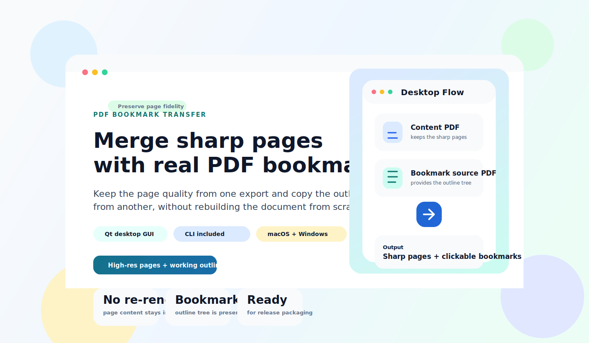
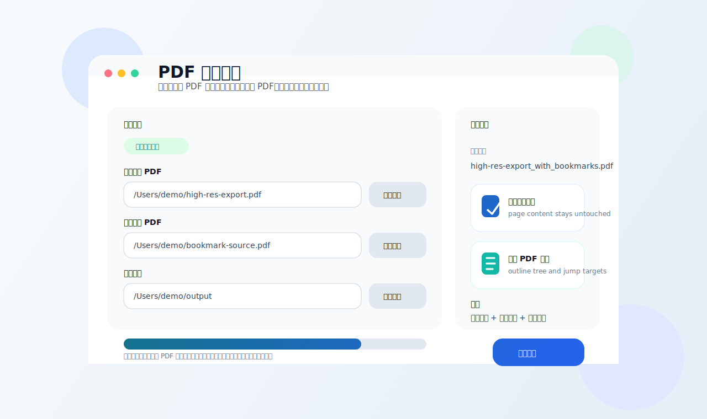
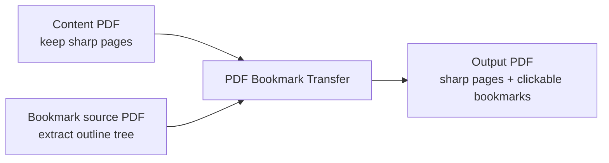

<div align="center">

# PDF Bookmark Transfer

<p><strong>Transfer bookmark outlines from one PDF onto another PDF with sharper page content, producing a final document with high-resolution pages and a clickable sidebar outline.</strong></p>

<p>
  <a href="#official-downloads">Official Downloads</a> ·
  <a href="#installation">Installation</a> ·
  <a href="#usage">Usage</a> ·
  <a href="#release--automation">Release Automation</a>
</p>

[简体中文](./README.md) | [English](./README_EN.md)

<p>
  
  
  
  
  
  
  
  
</p>

</div>

<div align="center">
  
</div>

## Overview

`PDF Bookmark Transfer` targets a common export problem: one PDF keeps the page content sharp but loses the sidebar outline, while another PDF preserves the bookmark tree but degrades the visual quality of the pages.

The project combines the two into a single output:

| Input file | Typical characteristic | Role in this project |
| --- | --- | --- |
| `Content PDF` | Sharp pages and high-resolution images, but no PDF sidebar bookmarks | Provides the final page content |
| `Bookmark source PDF` | Contains a valid outline tree, but the page quality is not ideal | Provides the bookmark structure, destinations, and styles |

The result keeps the pages from the `Content PDF` and copies the outline tree from the `Bookmark source PDF`, without re-rendering the document or rebuilding bookmarks by hand.

## Official Downloads

Official desktop packages are distributed through GitHub Releases and built automatically by GitHub Actions.

| Platform | Release asset | Download | Notes |
| --- | --- | --- | --- |
| macOS | `PDF Bookmark Transfer-macOS.zip` | [Latest macOS Download](https://github.com/Zhairest/PDF_Bookmark_Transfer/releases/latest/download/PDF%20Bookmark%20Transfer-macOS.zip) | Extract to get the `.app` desktop application |
| Windows | `PDF Bookmark Transfer-windows.zip` | [Latest Windows Download](https://github.com/Zhairest/PDF_Bookmark_Transfer/releases/latest/download/PDF%20Bookmark%20Transfer-windows.zip) | Extract to get the desktop application directory containing `PDF Bookmark Transfer.exe` |
| Checksums | `SHA256SUMS.txt` | [Latest Checksums](https://github.com/Zhairest/PDF_Bookmark_Transfer/releases/latest/download/SHA256SUMS.txt) | SHA-256 verification file |
| Release history | GitHub Releases | [Releases Page](https://github.com/Zhairest/PDF_Bookmark_Transfer/releases) | Historical versions and release notes |

## Key Capabilities

- Preserves the original page content without redrawing or recompressing pages
- Copies the PDF bookmark tree while keeping its hierarchy
- Preserves expanded state, color, bold, and italic bookmark styling where available
- Scales jump coordinates proportionally when page sizes differ slightly
- Sets the output file to open with the PDF outline pane visible
- Includes a desktop GUI built with `PySide6 / Qt`
- Includes a CLI entry point for automation and batch workflows
- Provides packaged desktop releases for macOS and Windows
- Publishes release assets automatically from version tags

## Interface Preview

> The image below is an interface illustration rather than a literal screenshot. Actual widget appearance follows the native `PySide6 / Qt` style of the host platform.

<div align="center">
  
</div>

## Workflow



## Installation

### Runtime Requirements

- Python 3.11+
- `pypdf`
- `PySide6-Essentials`
- `shiboken6`

For source-based usage:

```bash
python3 -m pip install -r requirements.txt
```

For CLI-only usage, the core dependency is `pypdf`.

## Usage

### Desktop GUI

Launch the desktop GUI:

```bash
python3 pdf_bookmark_transfer_app.py
```

Typical flow:

1. Select the `Content PDF`
2. Select the `Bookmark source PDF`
3. Edit the output file name if needed
4. Change the output directory if needed
5. Click `开始转换`

Default behavior:

- the output directory defaults to the same folder as the `Content PDF`
- the output file name defaults to the original name plus `_with_bookmarks.pdf`
- if the output path already exists, the app asks for overwrite confirmation

### Command Line

CLI example:

```bash
python3 merge_pdf_bookmarks.py \
  --content "content.pdf" \
  --bookmarks "bookmark-source.pdf" \
  --output "content_with_bookmarks.pdf"
```

Supported arguments:

- `--content`: PDF whose page content should be preserved
- `--bookmarks`: PDF whose outline tree should be copied
- `--output`: output file path
- `--force`: overwrite the output file when it already exists

When `--output` is omitted, the tool creates a default file name next to the `Content PDF`.

## Release & Automation

The official desktop release flow is defined in [`.github/workflows/release.yml`](./.github/workflows/release.yml).

When a version tag matching `v*` is pushed, the workflow automatically:

- builds `PDF Bookmark Transfer-macOS.zip` on `macos-13`
- builds `PDF Bookmark Transfer-windows.zip` on `windows-latest`
- generates `SHA256SUMS.txt`
- attaches all release assets to the corresponding GitHub Release

Local packaging entry points:

- [build_macos_app.sh](./build_macos_app.sh): builds the macOS `.app` bundle and `.zip`
- [build_windows_app.ps1](./build_windows_app.ps1): builds the Windows release directory and `.zip`
- [pdf_bookmark_transfer_app.spec](./pdf_bookmark_transfer_app.spec): cross-platform `PyInstaller` configuration

Local build dependency install:

```bash
python3 -m venv .venv-build
./.venv-build/bin/python -m pip install -r requirements-build.txt
```

## Technical Notes

### What Is Preserved

- outline hierarchy
- expanded / collapsed state
- bookmark colors
- bold / italic styling
- page-internal destinations
- default PDF page mode for showing the outline pane
- Chinese bookmark titles

### Assumptions

Direct bookmark transfer is valid when both PDFs share the same pagination model:

- same page count
- same page order
- the same section appears on the same page in both files

### Non-Goals

The following scenarios are outside the scope of direct bookmark transfer:

- different page counts
- extra inserted blank pages
- shifted pagination between exports
- the same section landing on different pages

Those cases require an explicit page-mapping layer rather than direct outline copying.

### Failure Conditions

- the `Bookmark source PDF` has no outline tree
- a bookmark points beyond the page range of the `Content PDF`
- the output path matches either input file
- the output file name contains characters that are unsafe for cross-platform use

## Project Structure

```text
.
├── .github/
│   └── workflows/
│       └── release.yml
├── docs/
│   └── assets/
│       ├── gui-preview.svg
│       └── project-hero.svg
├── CHANGELOG.md
├── CONTRIBUTING.md
├── LICENSE
├── README.md
├── README_EN.md
├── RELEASING.md
├── build_macos_app.sh
├── build_windows_app.ps1
├── merge_pdf_bookmarks.py
├── pdf_bookmark_transfer_app.py
├── pdf_bookmark_transfer_app.spec
├── requirements-build.txt
└── requirements.txt
```

Key files:

- [merge_pdf_bookmarks.py](./merge_pdf_bookmarks.py): CLI entry point and core bookmark-transfer logic
- [pdf_bookmark_transfer_app.py](./pdf_bookmark_transfer_app.py): desktop GUI built with `PySide6 / Qt`
- [pdf_bookmark_transfer_app.spec](./pdf_bookmark_transfer_app.spec): cross-platform `PyInstaller` configuration
- [build_macos_app.sh](./build_macos_app.sh): macOS packaging script
- [build_windows_app.ps1](./build_windows_app.ps1): Windows packaging script
- [`.github/workflows/release.yml`](./.github/workflows/release.yml): automated GitHub Releases build and publish workflow
- [docs/assets/project-hero.svg](./docs/assets/project-hero.svg): README hero asset
- [docs/assets/gui-preview.svg](./docs/assets/gui-preview.svg): README interface illustration

## Development Docs

- [CHANGELOG.md](./CHANGELOG.md): release history
- [CONTRIBUTING.md](./CONTRIBUTING.md): contribution workflow
- [RELEASING.md](./RELEASING.md): release procedure
- [LICENSE](./LICENSE): MIT license
- [requirements.txt](./requirements.txt): runtime dependencies
- [requirements-build.txt](./requirements-build.txt): packaging dependencies

## Verification

The repository has been verified for:

- local bookmark-transfer execution using sample PDFs
- local macOS `.app` and `.zip` packaging
- successful `codesign --verify --deep --strict` structure verification for the macOS `.app`
- configured GitHub release workflow for both macOS and Windows release assets

## License

Released under the [MIT License](./LICENSE).
